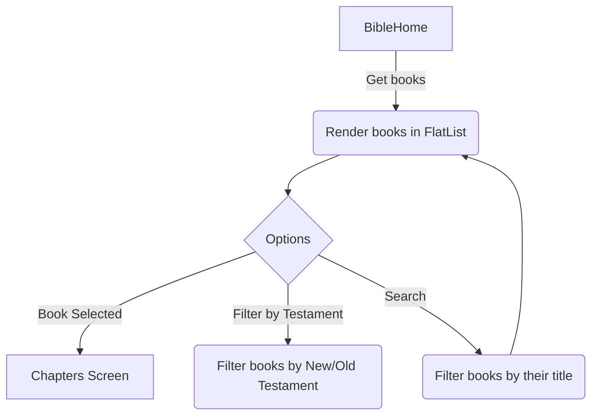
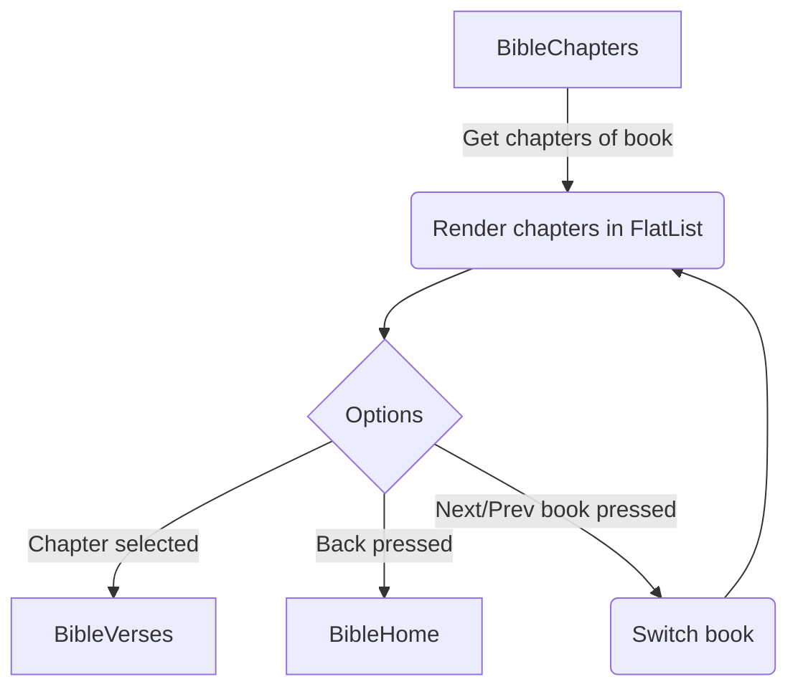
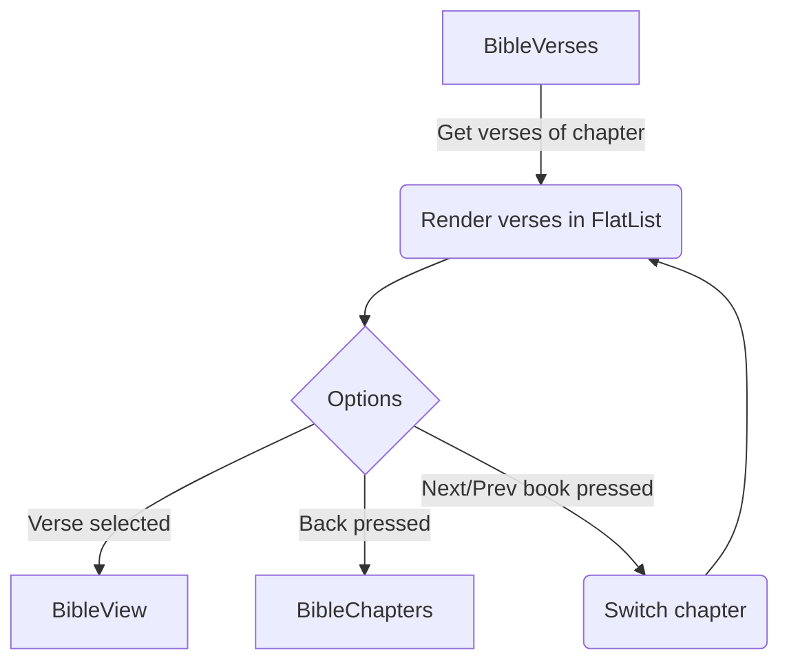
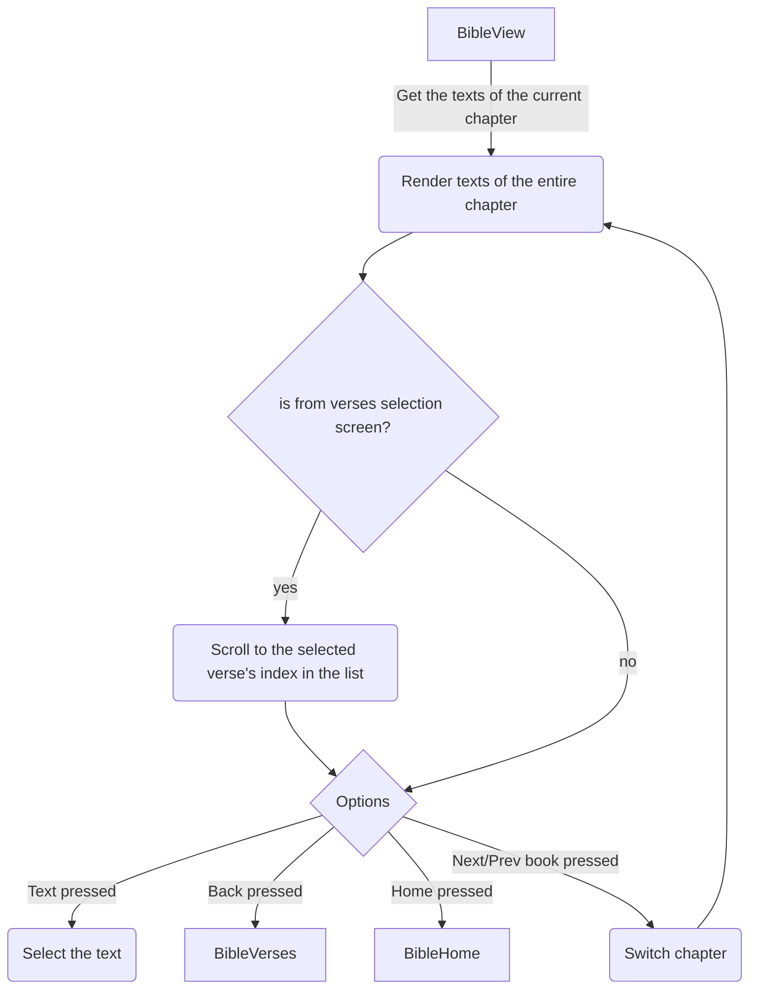

# Bible Screens
## Introduction
Bible screens heavily use `Reference` and methods from [biblejs](https://github.com/davewasmer/biblejs) package, we highly suggest you take a moment to check it out first before diving in.

### BibleChapters
Renders all the chapters of the book selected from [BibleHome](#BibleHome).
### BibleHome
The main menu for the bible, where the book list is rendered for selection.
### BibleScreen
Where the bible screen is initially launched, before stacking further bible screens, thus containing the navigation for the bible screens.
### BibleVerses
Renders all the verses of the book selected from [BibleChapters](#BibleChapters).
### BibleView
Where the actual texts of the book is rendered.
# Bible Screens' Components
### BibleAPI
#### Bible
Returns the whole bible as a JS Object.
#### getChapter(`bookID`: Number(), `chapterID`: Number())
Returns all the texts of book `bookID` in chapter `chapterID` using the [Bible](#Bible).
### BibleContexts
This helps track the current progress of the user within the bible screens. Has two exposed methods `useReferenceContext` and `useReferenceUpdate`.
#### useReferenceContext()
Takes the current Reference stored in BibleContexts.
#### useReferenceUpdate(`Reference()`)
Takes a single `Reference` as an argument. This function updates the current reference with the `Reference` argument passed.
### BibleHeader
The header for each of the bible screens. Has two props:
- `text` - The text that will appear at the center of the header.
- `disableBackButton` - whether to render header's back button.
### BibleItem
Rendered in a FlatList, these are the individual buttons rendered in the BibleHome, BibleChapters, and BibleVerses screens.
Has three props:
- `item`: `{id: Number(), type: String(), name: String()}` - an object that contains the properties of the current `BibleItem`.
- `book`: `Number()` - id of the book the current `BibleItem` belongs to.
- `chapter`: `Number()` - index of the chapter in the book of the current `BibleItem` belongs to.

### BibleNavigation
props:
- `text`: `String()` - the text that will be displayed in between the arrow buttons.
- `switchFunc`: `Function()` - the function that will handle the switching for the screens.
Used in BibleChapters, BibleVerses, and BibleView screens. This component navigates the screen through the bible using left and right buttons on both sides of the screen.
### bookList.js
An array that contains objects with the following keys:
- `id`: `Number()` - the book's ID.
- `type`: `String()` - value in this context is always `book` since this is the books list after all.
- `name`: `String()` - the book's name.
## Bible Screen's Flowchart

