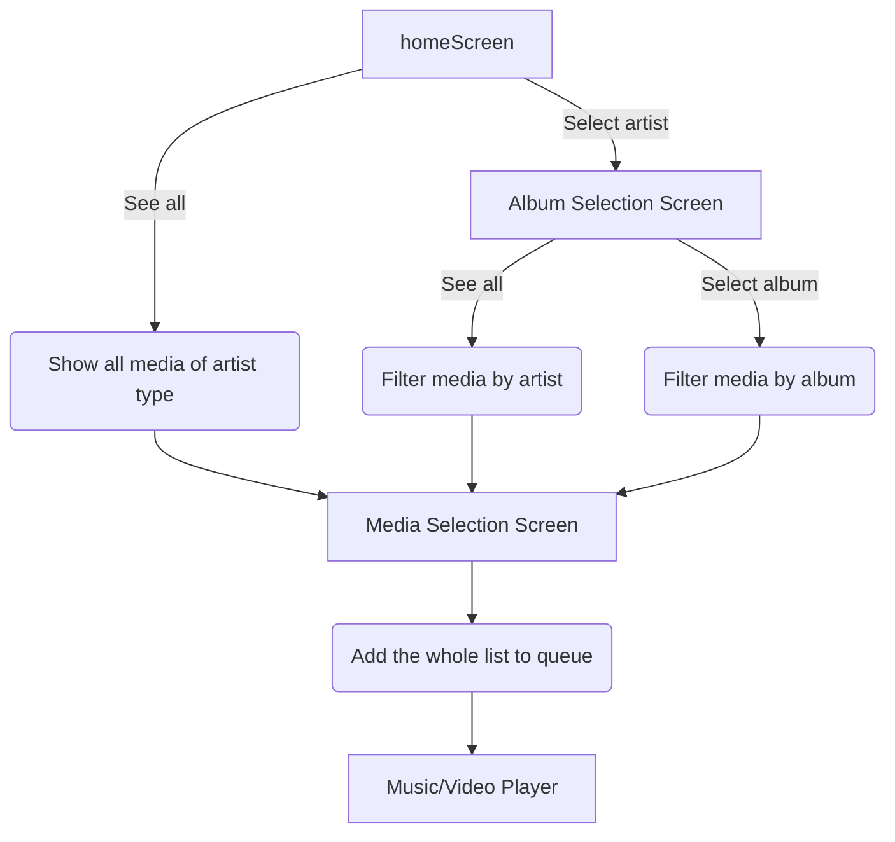

# Music and Video Screen Components
## CollectionList
- `sauce` - an array that contains [CollectionItem](#CollectionItem). This array will be rendered in a [FlatList](https://reactnative.dev/docs/flatlist).
- `nextScreen` - a `string` that indicates the next screen after the selection.
- `headerText` - additional text to be rendered before the list.
## ArtistList
- `sauce` - an array that contains [ArtistItem](#ArtistItem). This array will be rendered in a [FlatList](https://reactnative.dev/docs/flatlist).
- `nextScreen` - a `string` that indicates the next screen after the selection.
- `headerText` - additional text to be rendered before the list.
## MediaList
- `sauce` - an array that contains [MediaItem](#MediaItem). This array will be rendered in a [FlatList](https://reactnative.dev/docs/flatlist).
- `nextScreen` - a `string` that indicates the next screen after the selection.
- `headerText` - additional text to be rendered before the list.

# Media List JSON Format
Format for the JSON that will be fetched from the API.
## MediaItem
A JSON object containing the media's metadata. Contains the following key-value pairs:
| key        | value    | example                                | description                                              |
|------------|----------|----------------------------------------|----------------------------------------------------------|
| `id`       | `int`    | 0                                      | A unique identifier for the item.                        |
| `title`    | `string` | Sample Title                           | The media's title.                                       |
| `artist`   | `int`    | 69                                     | The media's artist/creator's ID.                         |
| `collection`   | `int`    | 420                                    | The media's album/collection ID, soon to be implemented. |
| `caption`  | `string` | This is what this song/video is about. | Caption/description for the media.                       |
| `image`    | `string` | https://example.com/image.jpeg         | URL for the media's album art/thumbnail.                 |
| `source`   | `string` | https://example.com/music.mp3          | URL for the media's source file.                         |
| `duration` | `int`    | 420                                    | The media's duration in seconds.                         |
## ArtistItem
A JSON object that contains the artist/creator's metadata. Contains the following key-value pairs:
| key     | value    | example                        | description                             |
|---------|----------|--------------------------------|-----------------------------------------|
| `id`    | `int`    | 0                              | A unique identifier for the artist.     |
| `name`  | `string` | Sample Name                    | The artist's name.                      |
| `image` | `string` | https://example.com/image.jpeg | URL for the artist's photo/icon.        |
| `cover` | `string` | https://example.com/cover.jpeg | URL for the artist's cover photo.       |
| `type`  | `string` | https://example.com/cover.jpeg | What type of content the artist makes   |

## CollectionItem
| key      | value    | example                        | description                                      |
|----------|----------|--------------------------------|--------------------------------------------------|
| `id`     | `int`    | 0                              | A unique identifier for the collection.          |
| `artist` | `int`    | 69                             | The collection artist's ID.                      |
| `title`  | `string` | Sample Name                    | The collection's title.                          |
| `image`  | `string` | https://example.com/image.jpeg | URL for the collection's image (e.g. album art). |
## Example
What the API should throw:

[MediaItem](#MediaItem)
```JSON
{
"id": 0,
"title": "Sample Title",
"artist": 69,
"series": 420,
"caption": "comments nung track/description ng vid",
"image": "https://example.com/image.jpeg",
"source": "https://example.com/music.mp3",
"duration": 420
}
```
[ArtistItem](#ArtistItem)

```JSON
{
"id": 0,
"name": "Artist Name",
"image": "https://example.com/image.jpeg",
"cover": "https://example.com/cover.jpeg"
}
```
[CollectionItem](#CollectionItem)

```JSON
{
"id": 0,
"artist": 69,
"name": "Collection Name",
"image": "https://example.com/image.jpeg",
}
```
# Flowchart

